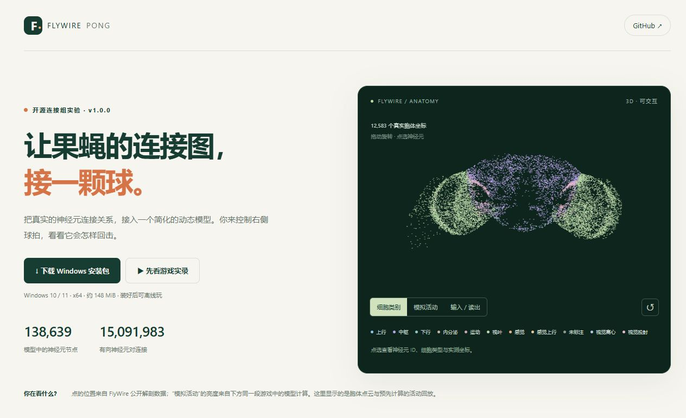

<div align="center">

# FlyWire Pong · 果蝇乒乓

**让果蝇的连接图，接一颗球。**

138,639 个神经元节点 · 15,091,983 条有向连接 · Windows 离线运行

[手机看 Demo / 3D 神经元图](https://buhuia1.github.io/flywire-pong/) · [下载 Windows 安装包](https://github.com/buhuia1/flywire-pong/releases/latest/download/FlyWire-Pong-Setup-1.0.0-Windows-x64.exe) · [所有版本](https://github.com/buhuia1/flywire-pong/releases)



</div>

这是一个使用真实 **FlyWire 果蝇神经元连接关系**的 Pong 游戏实验。我们给连接图配上简化的动态模型，再通过人为设计的游戏输入和事先训练的动作读出器，让它控制左侧球拍。你控制右侧球拍，可以随时打开三维神经元视图、切换对照和难度。

**位置和连接来自真实数据；神经活动是模型计算。** 当前版本没有在线学习，也没有复制活果蝇的完整大脑、视觉、身体或意识。完整解释见 [从接线图到游戏](电子果蝇_从接线图到游戏.md)。

## 朋友想玩？从这里开始

1. 下载 **[FlyWire-Pong-Setup-1.0.0-Windows-x64.exe](https://github.com/buhuia1/flywire-pong/releases/latest/download/FlyWire-Pong-Setup-1.0.0-Windows-x64.exe)**，约 **148 MiB**。
2. 双击安装，然后打开桌面的 **“果蝇 Pong”**。
3. 浏览器会打开游戏。移动鼠标控制右拍，点击球场发球；可调发球角度与难度。游戏里的“三维脑图”入口可以查看解剖点云和当前模拟活动。

**系统：Windows 10 / 11，x64。** 安装后占用约 277 MiB，无需安装 Python、CUDA 或单独下载数据；在自己电脑的 CPU 上离线运行。下载完成后，发布者的电脑可以关机。手机可以浏览 Demo 和三维点云，完整实时游戏请使用 Windows 安装版。

安装包是未签名的实验版本，Windows 可能显示未知发布者。请从本仓库 Releases 下载，并用 [SHA256SUMS.txt](https://github.com/buhuia1/flywire-pong/releases/download/v1.0.0/SHA256SUMS.txt) 核对文件完整性。源码 ZIP 面向开发者；普通玩家只需要上面的 `.exe`。

### 可以直接转发的口令

> GitHub 搜索 **buhuia1/flywire-pong**，下载 Windows 安装包，装好后离线玩！手机先看 Demo 和可旋转的果蝇神经元图：**https://buhuia1.github.io/flywire-pong/**

新仓库可能需要一段时间才被搜索收录，直接分享 [项目链接](https://github.com/buhuia1/flywire-pong) 最快。

## 手机 Demo 有什么？

- **可旋转、可点选的三维胞体点云**：显示 12,583 个有实测坐标的胞体，可按细胞类别、输入 / 读出节点、模拟活动着色。
- **30 秒连续游戏实录**：固定种子 `1001`、进阶难度，真实连接图控制左拍、右边为反弹墙；包含成功接球和漏球，支持暂停、拖动进度。
- **同步的模拟活动回放**：完整网络先在电脑上计算，再每 0.25 秒保存一次抽样胞体活动。手机只加载显示数据，不在后台计算 1,500 万条连接。
- 下载按钮、安装说明、科学边界、数据鸣谢和一键复制分享口令。

示意图显示的是**胞体位置**，不包含完整神经突起。138,639 个模型节点中，有 118,086 个匹配到有效胞体坐标；缺坐标的 20,553 个节点仍参与模型计算。网页抽样不改变安装版的完整网络规模。

## 它怎样控制球拍？

```text
游戏坐标和速度（5 维）
        ↓ 人为设计的编码
314 个 LC4 / LPLC2 输入节点
        ↓ 固定的真实连接关系 + 简化 tanh 速率动力学
138,639 个节点、15,091,983 条有向神经元对连接
        ↓ 192 个下游节点的活动
离线训练的线性动作读出器 → 左侧球拍
```

有向连接数量指神经元对的加权边，约对应上游 5,449 万个突触接触，不能把两种计数混用。动力学使用接收端归一化的有符号权重，沿用上游递质预测的正负号；不是原论文的 Brian2 LIF 模型。

外部读出器用规则跟球的示范做监督训练。真实图组的读出器只读取神经元状态；直接状态对照读取游戏坐标。游戏过程中二者的参数均冻结。

## 对照与结果

安装版包含 8 种算法条件，另有手动控制。基准使用相同的独立左侧来球，3 个测试种子 × 每个种子 35 次来球。下表是接球率；它不是人与模型对战胜率，也不是在线学习曲线。

| 条件 | 入门 | 进阶 | 挑战 |
|---|---:|---:|---:|
| 真实连接图 + 训练读出 | 100.0% | 100.0% | 76.2% |
| 人工重连图 + 单独训练读出 | 100.0% | 100.0% | 73.3% |
| 直接游戏状态 + 训练读出 | 100.0% | 100.0% | 75.2% |
| 真实图 + 随机读出 | 21.9% | 20.0% | 11.4% |
| 断开递归连接 | 20.0% | 14.3% | 11.4% |
| 关闭感觉输入 | 20.0% | 14.3% | 11.4% |
| 随机动作 | 22.9% | 17.1% | 12.4% |
| 规则跟球 | 100.0% | 100.0% | 75.2% |

当前结果**没有证明真实果蝇拓扑优于简单对照**。只测试了一张人工重连图，种子与任务覆盖也有限。逐次计数和设置见 [benchmark.json](results/benchmark.json)，训练设置见 [training.json](results/training.json)。

## 从源码运行

推荐 Python 3.12。普通玩家无需执行本节。

```bash
git clone https://github.com/buhuia1/flywire-pong.git
cd flywire-pong
python -m venv .venv
```

激活环境：Windows PowerShell 使用 `.venv\Scripts\Activate.ps1`；macOS / Linux 使用 `source .venv/bin/activate`。随后运行：

```bash
python -m pip install -r requirements.txt
python scripts/download_data.py
python desktop_app.py
```

下载脚本从版本固定的 Release 获取约 112 MiB 的两张完整稀疏矩阵，并校验压缩包及每个文件的 SHA-256。GUI 默认打开 `http://127.0.0.1:8751/`。安装包本身已经包含这些数据。

源代码的可选 GPU 路径：另行安装与设备兼容的 PyTorch，然后执行 `python server.py --device cuda --port 8741`，在浏览器打开 `http://127.0.0.1:8741/`。Windows 安装包使用 CPU；macOS / Linux 源码路径尚未做设备验证。

### 自检和重新生成 Demo

```bash
python desktop_app.py --self-test results/local-selftest.json
python scripts/record_demo.py
python -m http.server 8761 --directory docs --bind 127.0.0.1
```

自检核对两张图的 CPU 数值参考、读出范围和随包资源。记录脚本按当前图与读出器重算实录，保存来源哈希和活动编码。浏览器访问 `http://127.0.0.1:8761/` 查看静态页面。若有 Node.js，可以执行 `node verify_motion.js` 检查渲染预测的边界行为。

### 研究复现

安装 `requirements-research.txt` 后，可使用 `prepare_data.py`、`prepare_controls.py`、`prepare_anatomy.py` 重新生成数据，再用 `experiment_v2.py --device cpu` 训练与评估。预处理输入需从 [THIRD_PARTY.md](THIRD_PARTY.md) 指定的上游提交下载到 `data/`，文件名和 SHA-256 在 [data/manifest.json](data/manifest.json) 与 [data/anatomy_manifest.json](data/anatomy_manifest.json) 中。日常运行使用已校验的 Release 数据即可。

## 仓库结构

| 位置 | 内容 |
|---|---|
| `docs/` | GitHub Pages 手机预览、真实胞体坐标与实录 |
| `web/` | 本机实时游戏与三维活动视图 |
| `fly_model.py`、`pong.py`、`server.py` | 神经动力学、游戏物理与本机接口 |
| `results/` | 已训练读出器、基准和精选验证结果 |
| `data/` | 来源、许可、坐标索引和运行数据下载清单 |
| `scripts/` | 数据下载与实录生成 |
| `packaging/` | Windows 打包脚本、版本与构建说明 |
| GitHub Releases | Windows 安装包、完整矩阵 ZIP、校验值 |

## 验证与常见问题

- 已在构建机 Windows 11 上完成实际安装、离线自检、游戏 / 三维入口、重复启动、暂停和卸载测试。安装自检移除了子进程的 Python / Conda 路径，并阻断外部代理访问。
- 已保存 CPU / GPU 数值一致性与游戏控制验证结果。构建机安装版浏览器测得约 60 FPS、约 6 ms 本地请求往返；这不是所有设备的性能保证。
- 本机监听地址为 `127.0.0.1`，无需远程服务器。游戏通过本机浏览器展示，离线也能打开。
- 关闭所有游戏 / 脑图页面后，安装版约 15 秒暂停运算，约 10 分钟自动退出；也可使用页面“退出游戏”。
- 启动问题可查看 `%LOCALAPPDATA%\FlyWirePong\logs\desktop.log`。提交 Issue 时请先移除日志里的个人路径等信息。
- Windows 构建说明见 [packaging/BUILD.md](packaging/BUILD.md)。

## 来源与许可

原创程序代码使用 [MIT License](LICENSE)。**FlyWire 数据、预处理矩阵及其衍生解剖 / 活动展示资源使用 CC BY-NC 4.0 非商业条款**；代码许可不替代数据许可。详见 [THIRD_PARTY.md](THIRD_PARTY.md) 和 [data/DATA_LICENSE.md](data/DATA_LICENSE.md)。

主要来源：

- Shiu et al. (2024), *A Drosophila computational brain model reveals sensorimotor processing*. [Nature](https://doi.org/10.1038/s41586-024-07763-9) · [模型数据仓库](https://github.com/philshiu/Drosophila_brain_model)
- Dorkenwald et al. (2024), *Neuronal wiring diagram of an adult brain*. [Nature](https://doi.org/10.1038/s41586-024-07558-y)
- Schlegel et al. (2024), *Whole-brain annotation and multi-connectome cell typing of Drosophila*. [Nature](https://doi.org/10.1038/s41586-024-07686-5)
- [FlyWire 更新注释与实测胞体坐标](https://github.com/flyconnectome/flywire_annotations) · [DesktopFly 感觉细胞身份注释](https://github.com/DenisSergeevitch/desktop-fly)

这是独立实验项目，与 FlyWire、上述研究团队及 DishBrain 无官方隶属关系。

---

**English:** FlyWire Pong is a connectome-constrained game prototype using 138,639 neuron IDs and 15,091,983 measured directed neuron-pair connections. A simplified rate network and an offline-trained linear readout control the left paddle. The Windows installer runs locally on CPU. The static mobile demo shows a genuine model-run replay and sampled measured soma positions. No online learning, measured brain activity, or biological superiority is claimed. Original code: MIT; FlyWire data and derivatives: CC BY-NC 4.0.
